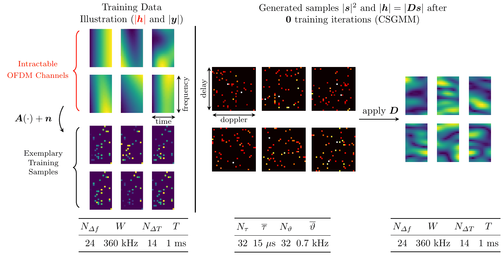
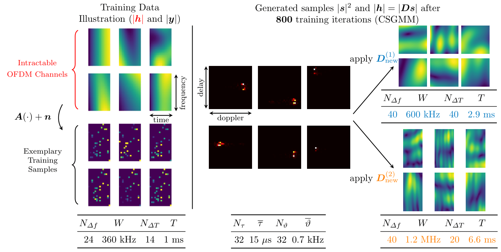
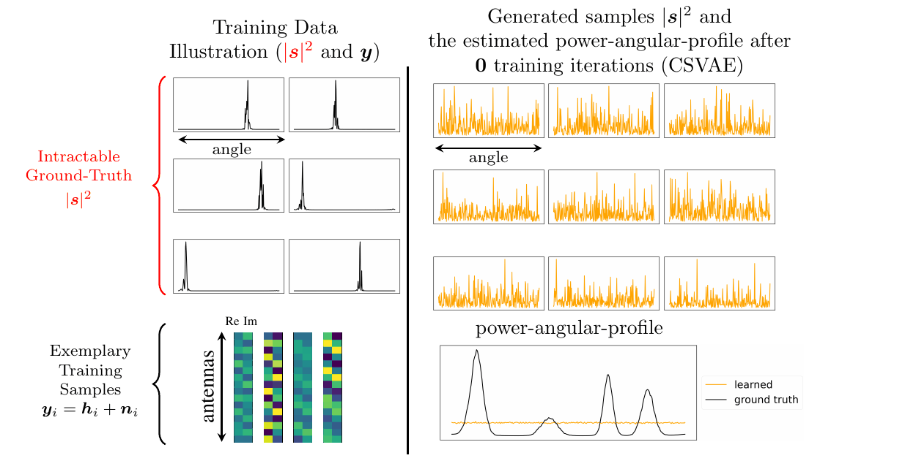

# Physics-Informed Generative Modeling of Wireless Channels
Welcome to the repository for the paper "Physics-Informed Generative Modeling of Wireless Channels" (ICML 25). 

Source code of the paper 
>B. Böck, A. Oeldemann, T. Mayer, F. Rossetto, and W. Utschick,
>"Physics-Informed Generative Modeling of Wireless Channels," in Forty-Second International Conference on Machine Learning, 2025.
<br>

Link to the paper (Openreview): [here](https://openreview.net/forum?id=FFJFT93oa7&noteId=Y7apHZeLcO)

## Requirements
The code is tested with `python 3.10`, `pytorch 2.5.1` and `pytorch-cuda 12.1`.

## Instructions

The directory `data/modified_3GPP` contains two modified 3GPP datasets (numpy array) with 12000 samples and 16 and 256 antennas, respectively. 

The directory `data/QuaDRiGa` contains two 5G 24x14 OFDM QuaDRiGa datasets (numpy array) with 12000 samples within an urban and rural environment, respectively. 

The directory `src/modules` contains the complex-valued CSGMM and CSVAE implementations for wireless channels (for more details see the .py files themself).

The directory `src/training` contains the training functions for the CSGMM and CSVAE implementations (for more details see the .py files themself).

The directory `src/utils` contains auxiliary functions.

The files `demo1_ofdm_csgmm_visual.py`, `demo2_3gpp_csvae.py`, and `demo3_ofdm_csvae.py` are standalone demo files that can be used to make you more familiar with the code. In particular, `demo1_ofdm_csgmm_visual.py` can be run on a CPU as it uses a numpy implementation of CSGMM (a pytorch version for CUDA can also be found in the modules folder). It plots generated samples during training, similar to the illustrations below. `demo2_3gpp_csvae.py`, and `demo3_ofdm_csvae.py` both can be run a GPU and train the CSVAE for SIMO and OFDM channel data, respectively. The scripts store exemplary generated samples over training in the `src/results/demos/demo2` and `src/results/demos/demo3` folder, respectively. 

## Citation
If you are using this code for your research, please cite

```bibtex

@inproceedings{
boeck2025physicsinformed,
title={Physics-Informed Generative Modeling of Wireless Channels},
author={Benedikt B{\"o}ck and Andreas Oeldemann and Timo Mayer and Francesco Rossetto and Wolfgang Utschick},
booktitle={Forty-second International Conference on Machine Learning},
year={2025},
url={https://openreview.net/forum?id=FFJFT93oa7}
}
```

## Summary and Illustration

We propose to use sparse Bayesian generative modeling ([Paper of SBGM](https://proceedings.neurips.cc/paper_files/paper/2024/hash/0857833a490eff6b49ce43eba1d01e8e-Abstract-Conference.html)), in particular two SBGM implementations, the CSVAE and CSGMM, for learning the site-specific distribution of the wireless channel within specific environments. In particular, our proposed methods can learn the distribution of the physical channel parameters (i.e., the path delays, dopplers, directions of arrival and departure and complex-valued path gains) based on noisy and compressed channel observations that an access point receives during default online operation. 

Below, you can see an illustration of the learning progress when training the CSGMM on noisy and compressed OFDM channel data. 

The **left upper corner** shows exemplary ground-truth but intractable OFDM channels (24 subcarriers, 360kHz bandwidth, 14 time symbols, 1ms whole duration) in absolute value generated by the geometry-based stochastic channel model QuaDRiGa in a rural environment (see Appendix D.2 in [our work](https://openreview.net/forum?id=FFJFT93oa7&noteId=Y7apHZeLcO) for more details on the dataset). 

The **left lower corner** shows the corresponding tractable but compressed and noisy channel observations characterized by the typical pilot OFDM pattern that masks out individual channel coefficients. We use these observations as training data for the CSGMM. 

The **middle part** shows exemplary generated samples by the CSGMM in the delay-doppler domain after (0,100,...) training iterations with a delay-doppler resolution of 32x32 and maximal resolvable delay and doppler of 1.5e-5 seconds and 700 Hz. 

The **right part** shows the corresponding generated OFDM channels using the dictionary that matches the training data. We see that the CSGMM learns to generate clean ground-truth OFDM channels while not having seen any ground-truth information during training. 



The trained CSGMM can also be easily adapted to any desired OFDM configuration without requiring retraining. Below you can see generated clean OFDM channels with 40 subcarriers, 600kHz bandwidth, 40 time symbols, 2.9ms whole duration (**right upper corner**) and 40 subcarriers, 1.2MHz bandwidth, 20 time symbols, 6.6ms whole duration (**right lower corner**). These OFDM channels have been generated using the exact same CSGMM that has been trained on the compressed and noisy "24 subcarriers, 360kHz bandwidth, 14 time symbols, 1ms whole duration" - OFDM data from the above illustration. 



Below, you can see an illustration of the learning progress when training the CSVAE on noisy and compressed SIMO channel data. 

The **left upper corner** shows exemplary ground-truth but intractable, highly resolved power-angular profiles of individual channels generated by a modified 3GPP channel model (see Appendix D.1 in [our work](https://openreview.net/forum?id=FFJFT93oa7&noteId=Y7apHZeLcO) for more details on the dataset). 

The **left lower corner** shows the corresponding tractable but noisy 16-dimensional channel observations (since we assume 16 antennas). We use these observations as training data for the CSGMM. 

The **right upper corner** shows the power-angular profiles of exemplary generated samples by the CSVAE after (0,10,...) training iterations. The **right lower corner** shows the corresponding estimated power angular profile averaged over 1000 generated samples. 



